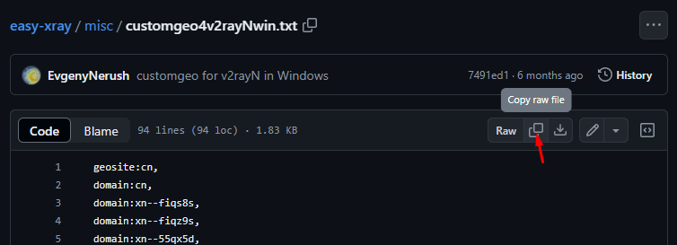
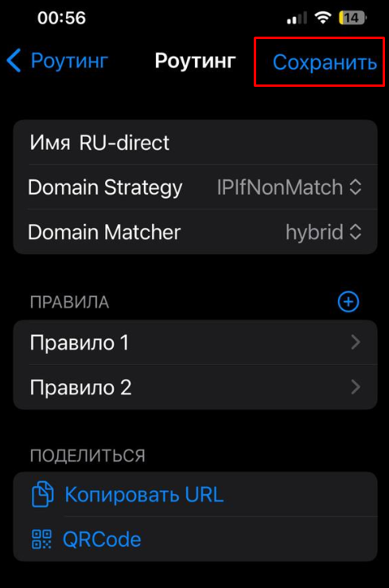

[Streisand в App Store](https://apps.apple.com/us/app/streisand/id6450534064).

## Базовая настройка

1. Скопировать url для подключения (`vless://...`)
2. Вставить url в приложении ("+" в правом верхнем углу)

  

## Дополнительная настройка маршрутизации для RU сайтов

1. Выключить ВПН (если включен) и скопировать строку

  ```
  streisand://aW1wb3J0L3JvdXRlOi8vWW5Cc2FYTjBNRERWQVFJREJBVUdEaGdaR2xWeWRXeGxjMTFrYjIxaGFXNU5ZWFJqYUdWeVZHNWhiV1ZlWkc5dFlXbHVVM1J5WVhSbFozbFVkWFZwWktJSEU5VUlDUW9MREEwT0R4QVNXMjkxZEdKdmRXNWtWR0ZuWFdSdmJXRnBiazFoZEdOb1pYSldaRzl0WVdsdVVtbHdWMjVsZEhkdmNtdFdaR2x5WldOMFZtaDVZbkpwWktDaEVWaG5aVzlwY0RweWRWZDBZM0FzZFdSdzFCUVZDZ3dORGhZU1cyOTFkR0p2ZFc1a1ZHRm5YV1J2YldGcGJrMWhkR05vWlhLaEYxbGtiMjFoYVc0NmNuVlpVbFV0WkdseVpXTjBYRWxRU1daT2IyNU5ZWFJqYUY4UUpFUkROVGxETXpsRExVUXdSRVl0TkRsR015MDVRVEl3TFVFMlJUVkVSakkwUkRaRE9RQUlBQk1BR1FBbkFDd0FPd0JBQUVNQVRnQmFBR2dBYndCeUFIb0FnUUNJQUlrQWl3Q1VBSndBcFFDeEFMOEF3UURMQU5VQTRnQUFBQUFBQUFJQkFBQUFBQUFBQUJzQUFBQUFBQUFBQUFBQUFBQUFBQUVK
  ```

2. Вставить url в приложении ("+" в правом верхнем углу)

  

3. Открыть "Роутинг"

  

4. Открыть "RU-direct"

  

5. Открыть "Правило 2"

  

6. Нажать "+" около "Domains"

  

7. Открыть [файл](misc/customgeo4hiddify.txt) и скопировать содержимое в буфер обмена

  

8. Вставить содержимое из буфера в поле ввода

  

9. Нажать "выполнено"

  

10. Сохранить изменения

  

11. Установить галочку около "RU-direct"

  

12. Включить роутинг

  

13. Вернуться на главную страницу и включить ВПН
