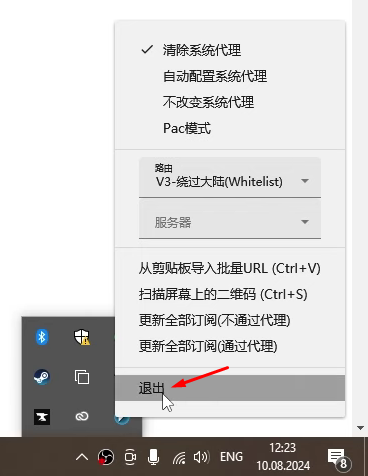

[V2rayN](https://github.com/2dust/v2rayN/) - клиент под Windows с графическим интерфейсом.

## Установка и первый запуск

1. Скачать [архив](https://github.com/2dust/v2rayN/releases/download/6.55/v2rayN-With-Core.zip)
2. Распаковать архив в `C:\Program Files`
3. Открыть папку `C:\Program Files\v2rayN-With-Core` и запустить `v2rayN.exe` от имени администратора
4. Сменить язык на русский - нажать 3 точки в правом верхнем углу

  

6. Закрыть приложение через крестик в правом верхнем углу
7. Выключить приложение в трее - "стрелочка" в правом нижнем углу экрана

  

## Подключение

1. Скопировать url для подключения (`vless://...`)
2. Запустить `v2rayN.exe` от имени администратора
3. Нажать "Сервера" и выбрать "Импорт массива URL из буфера обмена"

  

4. Включить режим ВПН

  

## Дополнительная настройка маршрутизации для RU сайтов

1. Открыть "Настройки" -> "Настройки маршрутизации"

  

2. Двойной клик ЛКМ по строке с "Whitelist"

  

3. Двойной клик по ячейке с "domain:example"

  

4. Открыть [файл](misc/customgeo4v2rayNwin.txt) и скопировать его содержимое

  

5. Удалить все в столбце "Domain" и вставить туда скопированный контент файла из буфера обмена

  

6. Нажать кнопку "Подтвердить" во всех окнах настроек, пока не появится главное окно приложения
